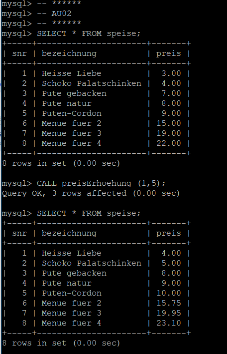
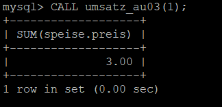
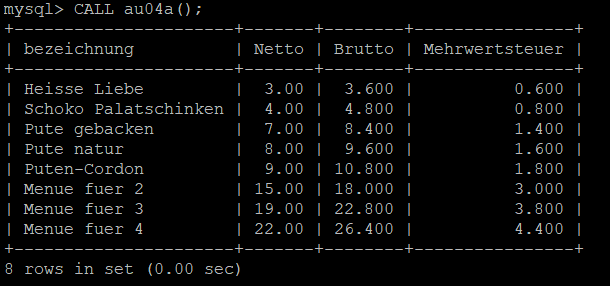
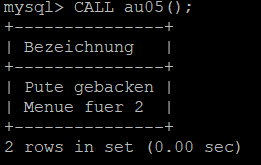
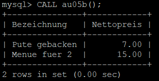
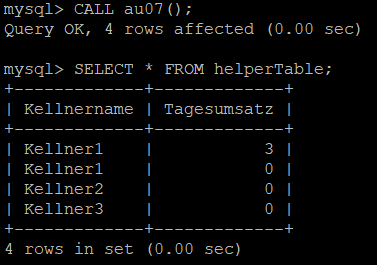

# __Konvertierung der Aufgaben zu MySQL Syntax__
Autor: Mario Fentler 5CHIT  
Datum: 06.01.2019 

Hier werden die zuvor in PostgreSQL geschriebenen Funktionen in MySQL konvertiert.  

Die Syntax in MySQL ist komplett anders als die in PostgreSQL. Beispielsweise können Stored Procedures in MySQL keine Werte zurückliefern. Somit fällt __RETURNS \<TYP> AS $$ ... $$__ weg. __Parameter__ von solchen Procedures werden mit einem Parameternamen deklariert. Die Verwendung von $1, $2, ... ist in MySQL nicht mehr möglich. Statt __AS $$ ... $$__ wird hier __BEGIN ... END;__ verwendet.  
Weiters kann man den __Delimiter__ vom Semikolon auf etwas anderes (bsp. //) ändern, da es sonst zu Syntax Fehlern kommen kann beim Aufbau von Stored Procedures. 

## __AU01__
Erstelle eine Funktion preis99() die auf 3 verschiedene Arten die Nachkommastellen vom Preis auf 99 ändert.  

### __Variante 1:__
---
```sql
DELIMITER //
DROP PROCEDURE IF EXISTS preiserhoehung_var1 //
CREATE PROCEDURE preiserhoehung_var1() 
    BEGIN
    UPDATE speise SET preis = ceil(preis) - 0.01;
    END;// 
DELIMITER ;

SELECT * FROM speise;
CALL preiserhoehung_var1();
SELECT * FROM speise;
```
<center>
<kbd>


Ergebnis AU01 - Variante 1
</kbd>
</center>

### __Variante 2:__  
---
```sql
DELIMITER //
DROP PROCEDURE IF EXISTS preiserhoehung_var2 //
CREATE PROCEDURE preiserhoehung_var2() 
    BEGIN
    UPDATE speise SET preis = floor(preis) + 0.99;
    END;//
DELIMITER ;

SELECT * FROM speise;
CALL preiserhoehung_var2();
SELECT * FROM speise;
```
<center>
<kbd>


Ergebnis AU01 - Variante 2
</kbd>
</center>

### __Variante 3:__
---
```sql
DELIMITER // 
DROP PROCEDURE IF EXISTS preiserhoehung_var3 //
CREATE PROCEDURE preiserhoehung_var3() 
    BEGIN
    UPDATE speise SET preis = TRUNCATE(preis,0) + 0.99;
    END;//
DELIMITER ;

SELECT * FROM speise;
CALL preiserhoehung_var3();
SELECT * FROM speise;
```
<center>
<kbd>


Ergebnis AU01 - Variante 3
</kbd>
</center>

## __AU02__
_Erstelle eine Funktion mit zwei Parametern: Speisen die billiger als der Durchschnittspreis aller Speisen sind, sollen um einen fixen Betrag erhöht werden. Speisen die teurer als der Durchschnittspreis sind, sollen um einen Prozentwert erhöht werden (AU02a). Achte darauf, dass sich die beiden Erhöhungen nicht gegenseitig beeinflussen (AU02b)!_  

Für die Aufgabe muss man Procedures mit Parametern benutzen. Da es allerdings nicht möglich ist eine Procedur innerhalb einer anderen aufzurufen, fällt hier die Hilfsmethode weg und alles wird in einer gemacht.  

__Parameter__ von Procedures werden in einer Klammer angegeben. Dort gibt man auch den Datentyp mit an. In der Procedure kann man sie dann ganz normal über den Parameternamen ansprechen.  
```SQL
DELIMITER //
DROP PROCEDURE IF EXISTS preisErhoehung //
CREATE PROCEDURE preisErhoehung (fixedValue DECIMAL(4,2),
percent DECIMAL(4,2))
BEGIN
    DECLARE avgPrice DECIMAL(20,10);
    SELECT avg(preis) INTO avgPrice FROM speise;
    UPDATE speise SET preis = preis + fixedValue 
    WHERE preis <= avgPrice;
    UPDATE speise SET preis = preis + preis * percent / 100 
    WHERE preis > avgPrice;
END;//
DELIMITER ;
```

In diesem Fall werden die Preise, die __kleiner__ als der Durchschnittspreis sind um 1 erhöht, alle anderen, die __größer__ sind um 5%.  
```SQL
SELECT * FROM speise;
CALL preisErhoehung (1,5);
SELECT * FROM speise;
```

<center>
<kbd>



Ergebnis AU02 a und b
</kbd>
</center>

## __AU03__
_Der Tagesumsatz für einen bestimmten Kellner soll für den aktuellen Tag ermittelt werden. Verwende die Kellner-Nr als Parameter, den aktuellen Tag via CURRENT_DATE (AU03)._

Um das zu überprüfen muss die Tabelle Rechnung noch überarbeitet werden, da dort die Rechnungen alle auf ein fixes Datum gesetzt wurden. Dazu wird dort einfach ein Datum auf CURRENT_DATE gesetzt und dann beim selecten nach dem dazugehörigen Kellner selected.  
```sql
INSERT INTO rechnung VALUES (7, CURRENT_DATE, 1, 'bezahlt', 1);
```
```sql
DELIMITER //
DROP PROCEDURE IF EXISTS umsatz_au03 //
CREATE PROCEDURE umsatz_au03(kellnerNr INTEGER(255))
    BEGIN
        SELECT SUM(speise.preis)
        FROM speise,rechnung,bestellung
        WHERE speise.snr = bestellung.snr
        AND rechnung.rnr = bestellung.rnr
        AND rechnung.status = 'bezahlt'
        AND rechnung.knr = kellnerNr
        AND rechnung.datum = CURRENT_DATE;
    END;//
DELIMITER ;

CALL umsatz_au03(1);
```
<center>
<kbd>



Ergebnis AU03
</kbd>
</center>

## __AU04__
_Erstelle eine weitere Funktion zur Berechnung der MWSt. Zeige von allen Speisen den Brutto-Preis als Brutto
und die darin enthaltene MWSt. als Spalte MWSt an (AU04a). Die Ausgabe Brutto/MWSt soll auf zwei
Nachkommastellen beschränkt werden (AU04b)._

### __a)__
---
Für die erste Aufgabe wird der Preis aus der Tabelle Speise ausgelesen und so modifiziert, dass die Spalten Brutto und Mehrwert ausgegeben werden können.  
```sql
DELIMITER //
DROP PROCEDURE IF EXISTS au04a //
CREATE PROCEDURE au04a()
    BEGIN
        SELECT bezeichnung,
        preis AS "Netto",
        preis * 1.2 AS "Brutto",
        preis * 0.2 AS "Mehrwertsteuer" 
        FROM speise;
    END;//

DELIMITER ;
CALL au04a();
```
<center>
<kbd>



Ergebnis AU04a
</kbd>
</center>

### __b)__
---
Um zahlen auf Nachkommastellen zu beschränken wird die __CAST__ Funktion verwendet.
```sql
DELIMITER //
DROP PROCEDURE IF EXISTS au04b //
CREATE PROCEDURE au04b()
    BEGIN
        SELECT bezeichnung,
        preis AS "Netto",
        CAST(preis * 1.2 AS DECIMAL (6,2)) AS "Brutto",
        CAST(preis * 0.2 AS DECIMAL (6,2)) AS "Mehrwertsteuer" 
        FROM speise;
    END;//

DELIMITER ;
CALL au04b();
```
<center>
<kbd>


Ergebnis AU04b
</kbd>
</center>

## __AU05__
_Es soll eine Funktion zur Anzeige der Bezeichnungen der noch nie bestellten Speisen (AU05a) erstellt werden. Erweitere die aufrufende SELECT-Anweisung so, dass das Ergebnis als Tabelle mit den Spaltenüberschriften "Bezeichnung"
und "Nettopreis" angezeigt wird (AU05b)._

### __a)__
---
Um die Speisen zu erhalten, die noch nie bestellt wurden muss man schon bestellte Speisen von der Gesamtmenge an Speisen abziehen und von diesen dann den Namen ausgeben.
```sql
DELIMITER //
DROP PROCEDURE IF EXISTS au05//
CREATE PROCEDURE au05()
BEGIN
    SELECT speise.bezeichnung AS "Bezeichnung" FROM speise
    WHERE speise.snr NOT IN (SELECT snr FROM bestellung);
END;//
DELIMITER ;
CALL au05();
```
<center>
<kbd>



Ergebnis AU05a
</kbd>
</center>

### __b)__
---
Das geht in SQL ganz einfach, indem man __SELECT xyz AS \<Spaltenname>__ dazuschreibt.
```sql
DELIMITER //
DROP PROCEDURE IF EXISTS au05b//
CREATE PROCEDURE au05b()
BEGIN
    SELECT speise.bezeichnung AS "Bezeichnung",
    speise.preis AS "Nettopreis" FROM speise
    WHERE speise.snr NOT IN (SELECT snr FROM bestellung);
END;//
DELIMITER ;
CALL au05b();
```
<center>
<kbd>



Ergebnis AU05b
</kbd>
</center>

## __AU06__
_Erstelle zwei Funktionen die in der SELECT-Klausel eingebettet werden, um damit zusätzliche Spalten je Kellner anzeigen zu können. Die aufrufende SELECT-Anweisung soll folgende Ausgabe produzieren:_  
_Kellnername, Anzahl der Rechnungen, Status der spätesten Rechnung_

Diese Aufgabenstellung ist nicht in MySQL lösbar. Der Grund dafür ist, dass man sich die Werte anzahlRechnung und statusRechnung nicht in Variablen zwischenspeichern kann. In diesen Variablen kann man sie nicht speichern weil sie mehr als eine Row als Result haben. Desweiteren kann man keine Procedures in einer Procedure aufrufen.

## __AU07__
_Es soll eine Liste der Kellner und deren jeweiliger Tagesumsatz ausgegeben werden._

Diese Abfrage ist schon etwas schwieriger. Um die Aufgabe zu lösen wird auch eine temporäre Tabelle benötigt (helperTable). Diese hat die Spalten Kellnername und Tagesumsatz.  

Um die Daten der Abfrage dort hinein zu bekommen muss in der Stored Procedure __INSERT INTO \<tablename>__ ausgeführt werden.
```sql

DROP TABLE IF EXISTS helperTable;
CREATE TABLE helperTable(
    Kellnername VARCHAR(255),
    Tagesumsatz NUMERIC
);

DELIMITER //
DROP PROCEDURE IF EXISTS au07 //
CREATE PROCEDURE au07()
BEGIN
    INSERT INTO helperTable
    SELECT kellner.name AS "kellnername",
    SUM(speise.preis) AS "tagesumsatz"
    FROM kellner
    INNER JOIN rechnung ON (rechnung.knr = kellner.knr)
    INNER JOIN bestellung ON (bestellung.rnr = rechnung.rnr)
    INNER JOIN speise ON (speise.snr = bestellung.snr)
    WHERE rechnung.datum = CURRENT_DATE AND
    rechnung.status = 'bezahlt'
    GROUP BY kellner.name
    UNION SELECT kellner.name, 0 FROM kellner;
END;//
DELIMITER ;
CALL au07();
SELECT * FROM helperTable;
```
<center>
<kbd>



Ergebnis AU07
</kbd>
</center>