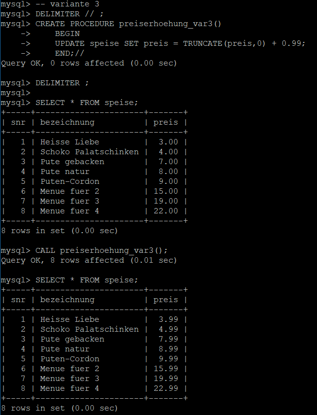

# __Konvertierung der Aufgaben zu MySQL Syntax__
Autor: Mario Fentler 5CHIT  
Datum: 15.12.2018  

Hier werden die zuvor in PostgreSQL geschriebenen Funktionen in MySQL konvertiert.

## __AU01__
Erstelle eine Funktion preis99() die auf 3 verschiedene Arten die Nachkommastellen vom Preis auf 99 ändert.  

### __Variante 1:__

<center>
<kbd>


Ergebnis AU01 - Variante 1
</kbd>
</center>

### __Variante 2:__  

<center>
<kbd>


Ergebnis AU01 - Variante 2
</kbd>
</center>

### __Variante 3:__

<center>
<kbd>



Ergebnis AU01 - Variante 3
</kbd>
</center>

## __AU02__
_Erstelle eine Funktion mit zwei Parametern: Speisen die billiger als der Durchschnittspreis aller Speisen sind, sollen um einen fixen Betrag erhöht werden. Speisen die teurer als der Durchschnittspreis sind, sollen um einen Prozentwert erhöht werden (AU02a). Achte darauf, dass sich die beiden Erhöhungen nicht gegenseitig beeinflussen (AU02b)!_  

Für die Aufgabe muss man Procedures mit Parametern benutzen. Da es allerdings nicht möglich ist eine Procedur innerhalb einer anderen aufzurufen, fällt hier die Hilfsmethode weg und alles wird in einer gemacht.  

__Parameter__ von Procedures werden in einer Klammer angegeben. Dort gibt man auch den Datentyp mit an. In der Procedure kann man sie dann ganz normal über den Parameternamen ansprechen.  
```SQL
DELIMITER //
CREATE PROCEDURE preisErhoehung (fixedValue DECIMAL(4,2),percent DECIMAL(4,2))
BEGIN
    DECLARE avgPrice DECIMAL(20,10);
    SELECT avg(preis) INTO avgPrice FROM speise;
    UPDATE speise SET preis = preis + fixedValue WHERE preis <= avgPrice;
    UPDATE speise SET preis = preis + preis * percent / 100 WHERE preis > avgPrice;
END;//
DELIMITER ;
```

In diesem Fall werden die Preise, die __kleiner__ als der Durchschnittspreis sind um 1 erhöht, alle anderen, die __größer__ sind um 5%.  
```SQL
SELECT * FROM speise;
CALL preisErhoehung (1,5);
SELECT * FROM speise;
```

<center>
<kbd>


Ergebnis AU02 a und b
</kbd>
</center>

## __AU03__
_Der Tagesumsatz für einen bestimmten Kellner soll für den aktuellen Tag ermittelt werden. Verwende die Kellner-Nr als Parameter, den aktuellen Tag via CURRENT_DATE (AU03)._

### __Überprüfen__
Um das zu überprüfen muss die Tabelle Rechnung noch überarbeitet werden, da dort die Rechnungen alle auf ein fixes Datum gesetzt wurden. Dazu wird dort einfach ein Datum auf CURRENT_DATE gesetzt und dann beim selecten nach dem dazugehörigen Kellner selected.

    -- dazu wurde bei den rechnungen das Datum noch auf das current Date gesetzt.
    SELECT * FROM umsatz(1);

## __AU04__

## __AU05__

## __AU06__
_Erstelle zwei Funktionen die in der SELECT-Klausel eingebettet werden, um damit zusätzliche Spalten je Kellner anzeigen zu können. Die aufrufende SELECT-Anweisung soll folgende Ausgabe produzieren:_  
_Kellnername, Anzahl der Rechnungen, Status der spätesten Rechnung_

## __AU07__
_Es soll eine Liste der Kellner und deren jeweiliger Tagesumsatz ausgegeben werden._