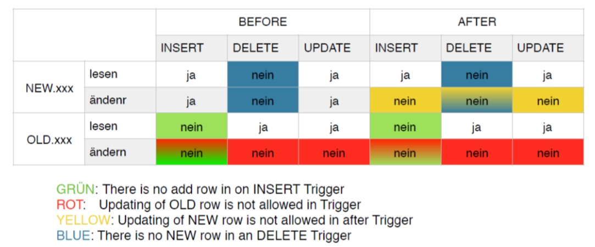

# Aufgabe Trigger
Mario Fentler 5CHIT  
20.02.2019  

## Deployment
Das File trigger.sql ausführen. Das File erstellt nach jedem Trigger die Datenbank neu um so für korrekte Testdaten zu sorgen. Weiters werden auch immer die Trigger getestet.

## Praxis
### a)
Wenn bei einer zu speichernden rechnung die Spalte datum den Wert NULL hat, soll sie jeweils durch den aktuellen Wert CURRENT_DATE ersetzt werden.  
```SQL
DELIMITER //
DROP TRIGGER IF EXISTS trigger_a//

CREATE TRIGGER trigger_a
    BEFORE INSERT
    ON rechnung
    FOR EACH ROW
BEGIN
    IF NEW.datum IS NULL THEN
        SET NEW.datum = CURRENT_DATE();
    END IF;
END; //
DELIMITER ;

SELECT * FROM rechnung;
INSERT INTO rechnung(rnr,datum,tisch,status,knr) VALUES (7,NULL,2,'offen',1);
SELECT * FROM rechnung;
```

### b)
Wenn in der Tabelle speise ein preis geändert wird, soll ein zusätzlicher Datensatz in
der Tabelle preisaenderung eingefügt werden. In der Spalte datum soll das aktuelle
Datum gespeichert werden und in der Spalte aenderung soll die Preisänderung
gespeichert werden. PK (snr, datum).
```SQL
-- Aufgabe b
-- creating table and trigger

DROP TABLE IF EXISTS preisaenderung;
CREATE TABLE preisaenderung(
    id INT(6) UNSIGNED AUTO_INCREMENT PRIMARY KEY,
    datum DATE,
    snr INTEGER,
    bezeichnung VARCHAR(255),
    preisVorher DECIMAL(6,2),
    preisNachher DECIMAL(6,2)
);

DROP TRIGGER IF EXISTS trigger_b;

DELIMITER //

CREATE TRIGGER trigger_b
    AFTER UPDATE
    ON speise
    FOR EACH ROW
BEGIN
    INSERT INTO preisaenderung(datum,snr,bezeichnung,preisVorher,preisNachher) VALUES(CURRENT_DATE,OLD.snr,OLD.bezeichnung,OLD.preis,NEW.preis);
END; //
DELIMITER ;

-- update preis pute natur
UPDATE speise SET preis = 4.5 WHERE snr = 4;
-- show in table
SELECT * FROM preisaenderung;
```

### c)
Wenn in der Tabelle bestellung ein Datensatz gelöscht wird, soll ein zusätzlicher
Datensatz in der Tabelle bestellstorno gespeichert werden.
```SQL
DROP TABLE IF EXISTS bestellstorno;
CREATE TABLE bestellstorno(
    datum DATE,
    anzahl SMALLINT,
    rnr         INTEGER,
    snr         INTEGER,
    PRIMARY KEY (rnr, snr),
    FOREIGN KEY (rnr) REFERENCES rechnung (rnr)
                    ON UPDATE CASCADE ON DELETE CASCADE,
    FOREIGN KEY (snr) REFERENCES speise (snr)
                    ON UPDATE CASCADE ON DELETE CASCADE
);

DROP TRIGGER IF EXISTS trigger_c;
DELIMITER //
CREATE TRIGGER trigger_c
    BEFORE DELETE
    ON bestellung
    FOR EACH ROW
BEGIN
    INSERT INTO bestellstorno (datum,anzahl,rnr,snr)
    VALUES (CURRENT_DATE(),OLD.anzahl,OLD.rnr,OLD.snr);
END; //
DELIMITER ;

-- Testing
SELECT * FROM bestellung;
DELETE FROM bestellung WHERE rnr = 4;
-- Datensatz wurde geloescht
SELECT * FROM bestellung;
-- Neuer Datensatz in der Stornotabelle
SELECT * FROM bestellstorno;
```

### d)
In der Tabelle statistik soll datumsabhängig die Anzahl aller im Restaurant
angebotenen Speisen dokumentiert werden. Erstelle alle erforderlichen Definitionen!

```SQL
DROP TABLE IF EXISTS statistik;
CREATE TABLE statistik(
    id INT(6) UNSIGNED AUTO_INCREMENT PRIMARY KEY,
    datum DATE,
    anzahl INTEGER
);

DROP TRIGGER IF EXISTS trigger_d;
DELIMITER //
CREATE TRIGGER trigger_d
    AFTER INSERT
    ON speise
    FOR EACH ROW
    BEGIN
        INSERT INTO statistik (datum,anzahl)
        SELECT
            CURRENT_TIME(),count(*)
        FROM speise;
    END; //
DELIMITER ;

INSERT INTO speise(snr,bezeichnung,preis) VALUES (9, 'Test menue', 14.5);
SELECT * FROM statistik;
INSERT INTO speise(snr,bezeichnung,preis) VALUES (10, 'Pizza', 3.99);
SELECT * FROM statistik;

```

### e)
Die ENGINE=MYISAM gestattet die Verwendung von Triggern. Realisiere eine 1:NBeziehung mit der ENGINE=MYISAM, d.h. das FK-Constraint und die CASCADEVerarbeitung sollen mittels Triggern nachgebildet werden.

## Theorie
### -) 
Sind mehrere Trigger für dasselbe Aktivierungs-Event (z.B. BEFORE INSERT ON xxx) zulässig?

### -)
Können innerhalb BEGIN … END mehrere SQL-Anweisungen definiert werden?

### -)
Können Trigger die Anweisungen START TRANSACTION, COMMIT oder ROLLBACK
enthalten?

### -)
Was bewirkt das Constraint NOT NULL in Kombination mit einem BEFORE-Trigger?
IF NEW.xxx IS NULL THEN SET NEW.xxx = ... END IF;  

### -)
Kann in einem Trigger auf Datensätze einer anderen Tabelle zugegriffen werden?  

### -)
